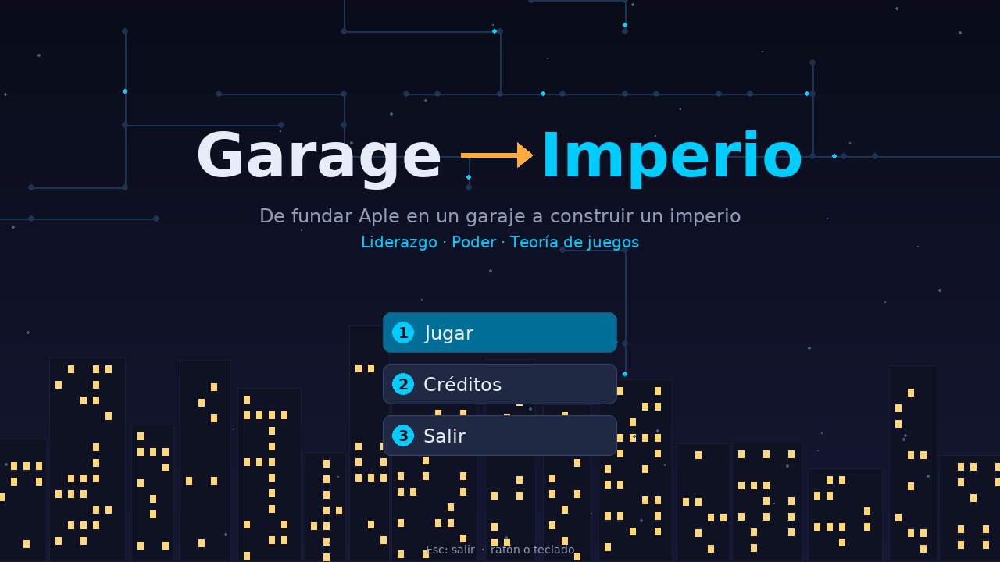
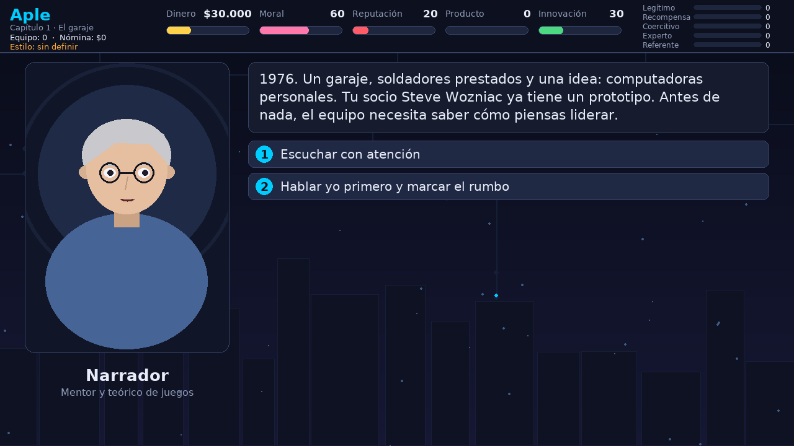
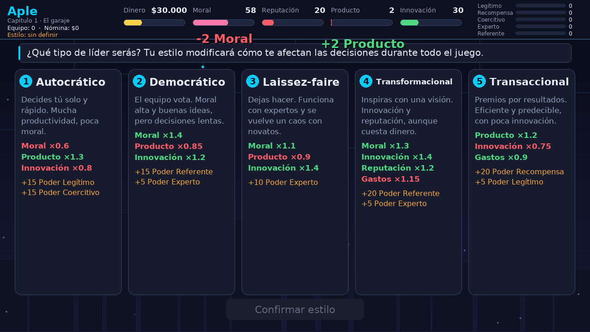
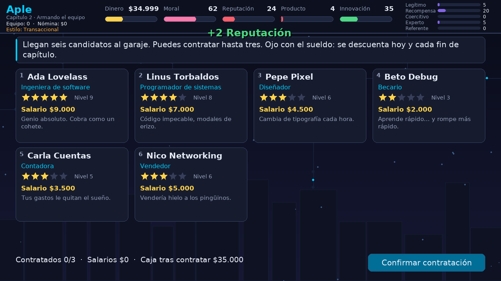
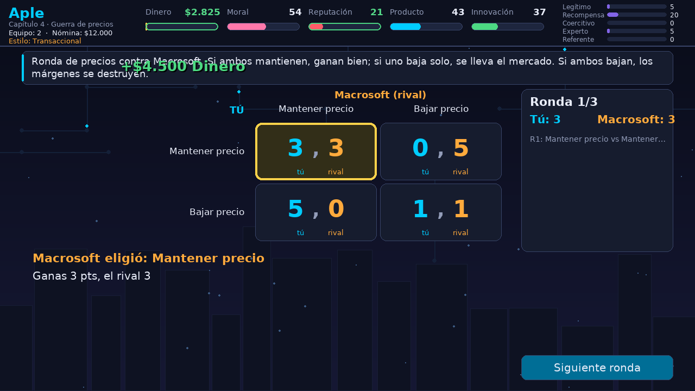
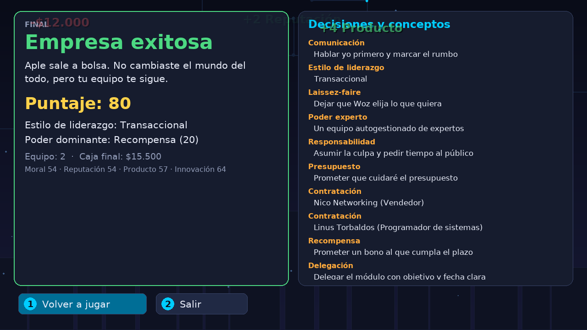
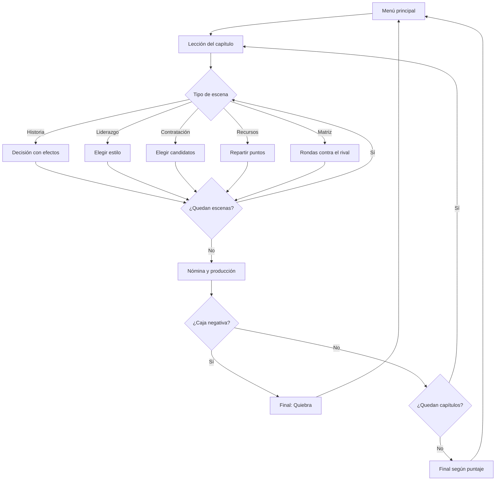

<div align="center">

# Garage → Imperio

**Juego de estrategia 2D sobre liderazgo de equipos, poder y teoría de juegos**

Funda *Aple* en un garaje, arma tu equipo, administra el presupuesto, enfréntate a *Macrosoft*
y decide si tu empresa termina en quiebra o se convierte en leyenda.




</div>

---

## Tabla de contenido

- [Instalación](#instalación)
- [Cómo se juega](#cómo-se-juega)
- [Capítulos y conceptos](#capítulos-y-conceptos)
- [Teoría de juegos en el juego](#teoría-de-juegos-en-el-juego)
- [Finales posibles](#finales-posibles)
- [Capturas](#capturas)
- [Arquitectura](#arquitectura)
- [Pruebas](#pruebas)
- [Herramientas](#herramientas)
- [Contexto académico](#contexto-académico)

---

## Instalación

Requisitos:

- **Python 3.10+**
- **Git**
- **[GitHub CLI](https://cli.github.com/)** con la sesión iniciada (`gh auth login`), porque el repositorio es privado.

**Linux / macOS**

```bash
gh repo clone miguel20041224/juego-liderar-equipos && cd juego-liderar-equipos && ./install.sh
```

**Windows (CMD)**

```bat
gh repo clone miguel20041224/juego-liderar-equipos && cd juego-liderar-equipos && install.bat
```

El instalador hace cuatro cosas:

1. Crea un entorno virtual (`.venv`).
2. Instala las dependencias.
3. Genera un lanzador.
4. Abre el juego.

| Acción | Linux / macOS | Windows |
|---|---|---|
| Jugar después de instalar | `./jugar.sh` | `jugar.bat` |
| Instalar sin abrir el juego | `./install.sh --no-run` | `install.bat --no-run` |
| Ejecutar manualmente | `.venv/bin/python -m liderar` | `.venv\Scripts\python -m liderar` |

<details>
<summary>Instalación sin GitHub CLI</summary>

```bash
git clone https://github.com/miguel20041224/juego-liderar-equipos.git
cd juego-liderar-equipos
./install.sh        # o install.bat en Windows
```

Git pedirá el usuario y un *personal access token* con acceso al repositorio.
</details>

---

## Cómo se juega

1. Pulsa **Jugar** en el menú principal.
2. Cada capítulo empieza con una **tarjeta de lección** que explica el concepto que vas a aplicar.
3. Toma decisiones. Cada una modifica tus indicadores:

   | Indicador | Significado |
   |---|---|
   | Dinero | Caja de la empresa. Si queda en negativo, quiebras. |
   | Moral | Motivación del equipo; influye en la productividad. |
   | Reputación | Imagen ante clientes, prensa e inversionistas. |
   | Producto | Avance del proyecto. |
   | Innovación | Capacidad de diferenciarte del rival. |
   | Poder | Cinco bases de poder (French y Raven) que habilitan decisiones especiales. |

4. Entre capítulos se paga la **nómina** y el equipo produce según su habilidad y su moral.
5. Al terminar verás:
   - tu **puntaje**;
   - tu estilo de liderazgo;
   - tu poder dominante;
   - un resumen de cada decisión con el concepto que aplicaste.

### Controles

| Tecla | Acción |
|---|---|
| Clic | Elegir una opción o pulsar un botón |
| `1` – `5` | Elegir la opción numerada |
| `Enter` / `Espacio` | Continuar, mostrar el texto completo o confirmar |
| `Esc` | Volver al menú o salir |

---

## Capítulos y conceptos

| # | Capítulo | Concepto | Mecánica |
|---|---|---|---|
| 1 | El garaje | **Estilos de liderazgo** | Eliges entre cinco estilos de liderazgo (ver la tabla siguiente). El estilo modifica los efectos de las decisiones posteriores y desbloquea opciones exclusivas. |
| 2 | Armando el equipo | **Gestión de personal y presupuesto** | Contratas candidatos con habilidad, salario y rasgos distintos, resuelves conflictos y decides cómo delegar. |
| 3 | El proyecto Aple II | **Gestión de proyectos** | Repartes recursos en el triángulo de restricciones (alcance, tiempo y costo) y gestionas riesgos como retrasos, *crunch* y *scope creep*. |
| 4 | Guerra de precios | **Teoría de juegos** | Dilema del prisionero repetido contra Macrosoft, con la matriz de pagos y el equilibrio de Nash. |
| 5 | La junta directiva | **Poder y política** | Conflicto con la junta. Usas poder legítimo, de recompensa, coercitivo, experto o referente, formas coaliciones y puedes acabar expulsado de tu propia empresa. |
| 6 | El gran trato | **Negociación e innovación cooperativa** | Juego de coordinación con Elon Mosk: alianza o competencia. |

### Estilos de liderazgo

| Estilo | Efecto sobre tus decisiones | Poder inicial |
|---|---|---|
| Autocrático | Producto ×1.3, moral ×0.6, innovación ×0.8 | Legítimo, coercitivo |
| Democrático | Moral ×1.4, innovación ×1.2, producto ×0.85 | Referente, experto |
| Laissez-faire | Innovación ×1.4, moral ×1.1, producto ×0.9 | Experto |
| Transformacional | Moral ×1.3, innovación ×1.4, reputación ×1.2, gastos ×1.15 | Referente, experto |
| Transaccional | Producto ×1.2, innovación ×0.75, gastos ×0.9 | Recompensa, legítimo |

---

## Teoría de juegos en el juego

- **Jugadores:** tú (*Aple*) y el rival de turno (*Macrosoft* o *Elon Mosk*).
- **Estrategias:** cooperar o competir; ambos eligen al mismo tiempo, durante varias rondas.
- **Pagos:** cada celda es `(tus puntos, puntos del rival)`. Los puntos se convierten en dinero y reputación.

Ejemplo del capítulo 4, el dilema del prisionero:

|  | Rival mantiene precio | Rival baja precio |
|---|:---:|:---:|
| **Tú mantienes precio** | 3 , 3 | 0 , 5 |
| **Tú bajas precio** | 5 , 0 | **1 , 1** ← equilibrio de Nash |

Ambos ganarían más cooperando (3, 3), pero a cada uno le conviene competir por separado. Al cerrar cada matriz, el juego calcula y resalta los equilibrios de Nash en estrategias puras.

Cada rival sigue una estrategia definida:

| Estrategia | Comportamiento | Dónde aparece |
|---|---|---|
| `tit_for_tat` (ojo por ojo) | Empieza cooperando y luego copia tu jugada anterior. | Capítulo 4 |
| `grim` (gatillo) | Coopera hasta que lo traicionas; desde entonces compite siempre. | Capítulo 4 |
| `random` | Elige al azar. | Capítulo 6 |
| `greedy` | Siempre compite. | Disponible en el motor |

---

## Finales posibles

Las condiciones se revisan en este orden; se aplica la primera que se cumple.

| Final | Condición |
|---|---|
| Quiebra | La caja queda en negativo. |
| Leyenda tecnológica | Puntaje ≥ 260 y trato cerrado con Elon Mosk. |
| Empresa exitosa | Puntaje ≥ 200: Aple sale a bolsa. |
| Sobreviviente | Puntaje ≥ 130: Aple sobrevive como empresa de nicho. |
| Absorbida | Cualquier otro caso: Macrosoft compra la empresa. |

---

## Capturas

| Historia y decisiones | Estilos de liderazgo |
|:---:|:---:|
|  |  |
| **Contratación con presupuesto** | **Matriz de pagos** |
|  |  |

<div align="center"></div>

---

## Arquitectura

El código se divide en tres capas:

- **Motor:** lógica pura, sin dependencias gráficas.
- **Contenido:** los datos del juego.
- **Interfaz:** todo lo que se dibuja en pantalla.

Para agregar o modificar capítulos solo hace falta editar `content.py`.

```
juego-liderar-equipos/
├── liderar/
│   ├── engine.py           # Estado, efectos, estrategias del rival, Nash y finales
│   ├── content.py          # Capítulos, escenas, personajes y textos
│   ├── __main__.py         # Punto de entrada: python -m liderar
│   └── ui/
│       ├── app.py          # Bucle principal, transiciones y flujo de pantallas
│       ├── theme.py        # Paleta, tipografía y componentes base
│       ├── background.py   # Fondo animado
│       ├── hud.py          # Indicadores y barras de poder
│       ├── portraits.py    # Retratos dibujados por código
│       ├── screens.py      # Título, lección, resumen y final
│       ├── scene_story.py  # Escenas narrativas
│       ├── scene_team.py   # Liderazgo, contratación y reparto de recursos
│       └── scene_matrix.py # Matrices de teoría de juegos
├── tests/                  # Pruebas unitarias del motor
├── docs/                   # Capturas y enunciado de la actividad
├── install.sh / install.bat
└── pyproject.toml
```

### Flujo del juego



---

## Pruebas

El motor no depende de pygame, así que se prueba con la biblioteca estándar:

```bash
python3 -m unittest discover -s tests -v
```

La prueba de humo recorre el juego completo sin abrir ventana, tomando decisiones al azar:

```bash
SDL_VIDEODRIVER=dummy .venv/bin/python -m liderar --smoke --seed 3
```

Si añades `--shots DIRECTORIO`, la partida automática guarda una captura de cada tipo de pantalla.

---

## Herramientas

| Herramienta | Uso |
|---|---|
| Python 3 | Lenguaje principal |
| pygame-ce | Ventana, renderizado 2D y entrada |
| Visual Studio Code | Editor |
| Git y GitHub | Control de versiones y distribución |
| unittest | Pruebas del motor |

---

## Contexto académico

Proyecto para la **actividad integradora** sobre liderazgo de equipos de proyecto ([enunciado](docs/enunciado.jpeg)). La consigna pide investigar la teoría de juegos y plantear un juego ambientado en el desarrollo de tecnologías, con sus jugadores y estrategias, que trate el liderazgo innovador, la política y el poder.

Los nombres de empresas y personajes (*Aple*, *Macrosoft*, *Elon Mosk*, etc.) son **parodias con fines exclusivamente educativos** y no representan a personas ni organizaciones reales.

**Autor:** [@miguel20041224](https://github.com/miguel20041224)
